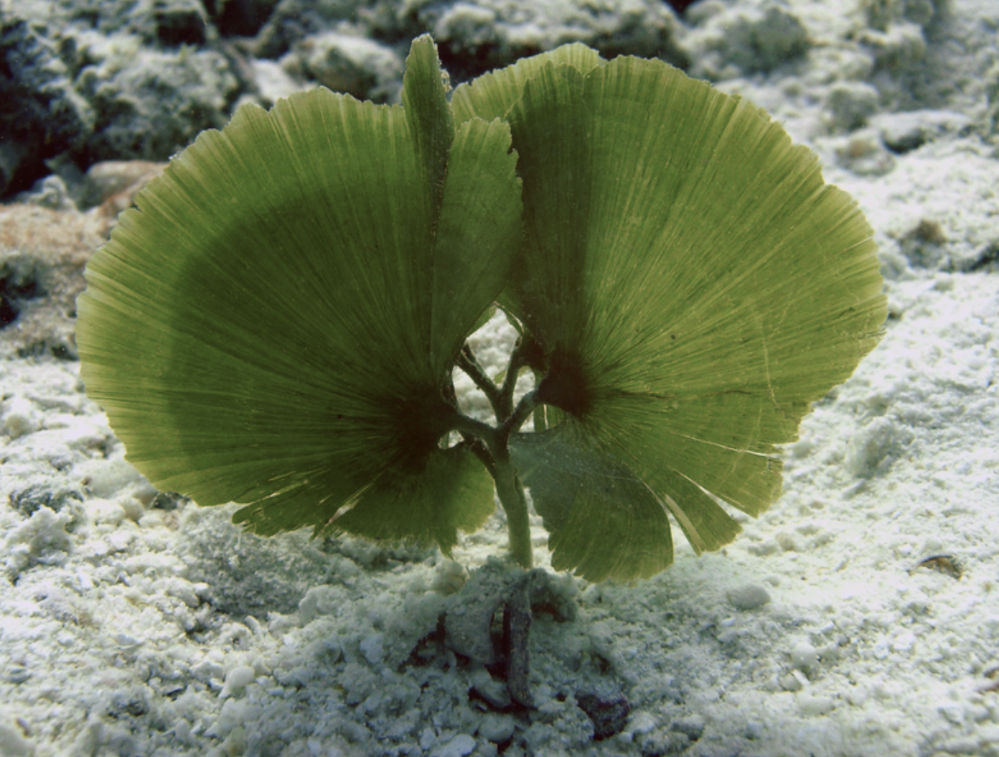
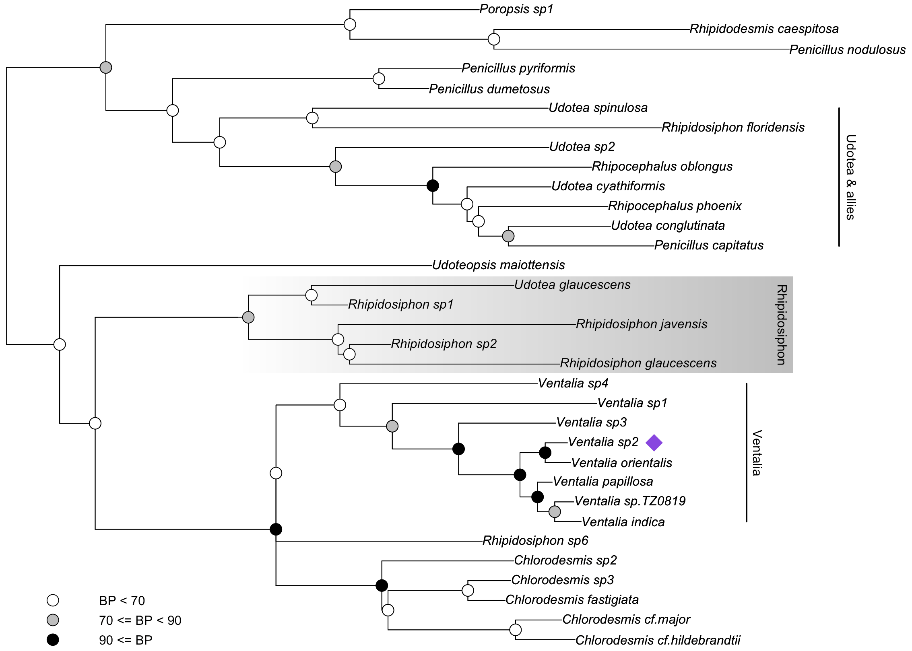
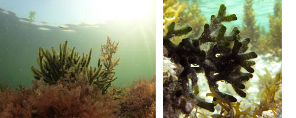
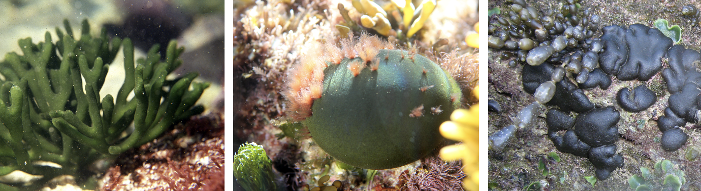

# BOTA30002: Intro to phylogenies and trait evolution in R


The goals of this computer lab are to:
- to get accustomed to working with trees and trait data in R
- to produce publication-quality figures directly in R 
- study and plot the evolution of a continuous trait
- study and plot the evolution of a discrete trait

R is an amazing environment to work with phylogenies thanks to the many great libraries that have been developed for it. There's definitely a learning curve, and I recommend these books, which cover both the basics and have heaps of practical examples.
- Paradis (2012) Analysis of Phylogenetics and Evolution with R. https://link.springer.com/book/10.1007/978-1-4614-1743-9 (free online access through UoM)
- Revell & Harmon (2022) Phylogenetic Comparative Methods in R. https://press.princeton.edu/books/paperback/9780691219035/phylogenetic-comparative-methods-in-r (not available at UoM at the moment)

Liam Revell, the developer of the phytools package, also has an outstanding website (mostly of blog posts) that illustrate use cases for phytools: http://blog.phytools.org/

## Install the R packages you'll need

I will assume you already have recent and working version of R and RStudio. We'll have to install and verify the installation of several packages that are used in the lab.
```{r}
install.packages("phytools")
library("phytools")
```
This code shows you how to install and load the `phytools` library. Make sure you have working installations of `phytools`, `geiger`, `ggplot` and `plotrix`. I think the latter two are installed by default, but double-check.

## Working with phylogenies in R
First you'll have to download the files in this github repository (see files listed above) to your machine. Then you'll have to set the working directory of R to the folder where those files are sitting on your machine.

You can now import a newick-formatted tree from file. The function for loading trees is not part of core R functionality. Instead it is in an add-on library called "ape" (analysis of phylogenetics and evolution). This code shows how to read a tree and store it in the variable `tr` (line 1), check the contents of the `phylo`` object that is generated (line 2), and make a basic plot of the tree (line 3)
```{r}
tr <- read.tree("udoteae.nwk")
tr
plot(tr)
```

This is a tree of green algal species in the tribe Udoteae. Here's an Udotea species just to give you an idea about these creatures.




In order to be able to use functions such as `read.tree`, you need to know the arguments they take. R functions all come with a help page, which can be viewed with the `?` symbol. For example, type `?read.tree` to see the documentation for this function.

From your analyses in the previous pracs you will probably have a tree in the Nexus format. Try to load this with the `read.nexus` command after looking up how to use it. Check whether the tree has been loaded as illustrated above.

## Refining tree plots for presentations or publications

R has a lot of functionality to customise plots of trees, which can save you a lot of time fiddling around with graphical programs and, importantly, doing it in R makes it more reproducible.

Let's start with some simple changes and additions to the tree we loaded before.

```{r}
# open the help page for tree plotting
?plot.phylo
# plot the tree with taxon labels 1.5x larger than default
plot(tr,cex=1.5)
# use fat purple branches, just because you can
plot(tr,edge.color="purple",edge.width=5)
# adding a scale bar
add.scale.bar()
# manually clicking the mouse to add the scale bar in a particular location
add.scale.bar(ask=TRUE)
# show internal node numbers
nodelabels()
```

Instead of showing the node numbers, the `nodelabels` function can also be used to plot other things, like bootstrap values at nodes.
```{r}
bsval = tr$node.label
plot(tr)
nodelabels(bsval,adj=c(1.2,-0.2),frame="n",cex=0.8)
```

That's informative but bland; let's get fancy with bootstrap visualisation by defining some thresholds and coloring (well, gray-scaling) nodes based on those.
```{r}
# define a set of colors
co <- c("black", "grey", "white")
# classify the bootstrap values depending on their value
p <- character(length(bsval))
p[bsval >= 90] <- co[1]
p[bsval < 90 & bsval >= 70] <- co[2]
p[bsval < 70] <- co[3]
# and plot everything
plot(tr)
nodelabels(node = 35:65, pch = 21, bg = p[-1], cex = 2)
# that also needs a legend
points(rep(0.005, 3), 1:3, pch = 21, cex = 2, bg = co)
text(rep(0.01, 3), 1:3, adj = 0,c("90 <= BP", "70 <= BP < 90", "BP < 70"))
```
Now imagine there's that one precious species in the tree that really needs to be decorated with a symbol. First thing to do is find the number of that taxon by clicking it.
```{r}
identify(tr) 
```
Let's say you've identified node `11` and want to annotate that with a purple diamond.
```{r}
node <- 11
points(0.07, node, pch = 18, col = "purple", cex = 3)
```
Note that the first value in that `points` command is the value along the x-axis of the plot. The `0.07` value I've used there is guessed based on seeing the scale bar in the plot above and may need adjusting if you work with another tree. Play around with this until it goes where you want it.

Now let's add some higher-level classification names to the plot. Say all taxa between node 7 and 14 belong together in a genus (they do, and the genus name is *Ventalia*).
```{r}
# first we set the node numbers for the bottom and top taxa in the group, determined as before with identify(tr), and we set a value along the x-axis where to plot the bar
y1 <- 7
y2 <- 14
xval <- 0.08
# and plot the bar with the genus name
segments(xval,y1,xval,y2,lwd=2)
offset <- 0.015
text (xval*(1+offset),(y1+y2)/2,"Ventalia",srt=270)
```
Let's do another one, just because we can.
```{r}
y1 <- 21
y2 <- 28
xval <- 0.09
segments(xval,y1,xval,y2,lwd=2)
offset <- 0.015
text (xval*(1+offset),(y1+y2)/2,"Udotea & allies",srt=270)
```
At this point, our imagination is the limit. We could add anything to this tree. Here's how to do a box with a grey-scale ramp:
```{r}
# defining the x and y limits for the box
y1 <- 15
y2 <- 19
leftX <- 0.025
rightX <- 0.085
# define a palette and plot a rectangle with a gradient
pal <- colorRampPalette(c("white","grey"))
gradient.rect(leftX,y1-.45,rightX,y2+.45,col=pal(100),border=NA)
# and add the taxon name to this
offset <- 0.015
text(rightX*(1-offset),(y1+y2)/2,"Rhipidosiphon",srt=270)
# great, but part of the tree disappeared... let's get it back
par(new=TRUE)
plot(tr)
# and the node circles need to go back on top
nodelabels(node = 35:65, pch = 21, bg = p[-1], cex = 2)
```
The end result is quite a difference from the basic plot from the beginning, and you can easily see how these modifications get you to the point where a publication-ready figure can be exported directly from R.




## Analysing and plotting continuous traits
In this section of the lab, we'll start working with traits, a continuous trait in this case. We'll be looking at the temperature preferences of some *Codium* species. What's *Codium*? I'm glad you asked. This is another green algal genus which looks like this:


The temperature preferences that we'll analyse were determined by taking the geographic coordinates of all occurrences we have for the species in the tree, and deriving the average sea surface temperature for those places from satellite imagery.

Let's load the data:
```{r}
t <- read.tree("codium.nwk")
d <- read.table("traitdata.tsv",header=T)
```
The table with data is read with the `read.table` command. The `header=T` bit tells the function that the first row consists of column names.

Investigate what you have in the `t` and `d` variables. Spend some time investigating the structure of `d`.

To work with those data more conveniently, let's define a clean variable containing only the SST data:
```{r}
sst <- d$temp
names(sst) <- rownames(d)
```
This `d$temp` pulls the `temp` column out of `d` and puts it in a new variable `sst`. Then taxon names are assigned to the values in `sst` by getting the rownames from `d`.

Using the `fastAnc` function from `phytools`, we can estimate ancestral states for each node in the tree. And we can plot this with the `contMap` function.
```{r}
anc <- fastAnc(t,sst)
maps <- contMap(t,sst)
# inverting the color scale and remapping to make it more intuitive
maps$cols[] <- maps$cols[length(maps$cols):1] 
plot(maps)
```
## Analysing and plotting discrete variables

The trait we'll analyse here is the functional morphology of Codium species. There are three types of overall body types: upright branched, ball-forming and mat-forming.



We've already imported the data in `d` higher up. We just need to get in into a clean variable like we did for temperature above.
```{r}
morph <- d$morph
names(morph) <- rownames(d)
```
Now let's estimate some ancestral states for thallus morphology.
```{r}
mfit <- fitMk(t,morph,model="ER")
anc <- ancr(mfit)
plot(anc)
```
The first function `fitMk` uses a model conceptually similar to those used in ML phylogenetic inference to determine the model of evolution for this trait, mainly optimising the rate of evolution of the trait. Following that, the `ancr` function estimates ancestral states using that function, and they are plotted on the last line.

Investigate the results you get. What morphology was the ancestor of the genus? How many times did other morphologies evolve from that ancestral state?

Great, we now have some idea of the ancestral states in this phylogeny. An untested assumption with what we've done before is that all transitions between trait states are equally likely to happen. This assumption was made by specifying the "ER" model (equal rates) above. But that's not necessarily the case. Using model comparison (model testing) similar to that you've seen for phylogenetic inference, we can optimise and compare multiple models. Specifically we'll compare the "ER" model with the "ARD" model (all rates different). We're doing this in the `fitDiscrete` function of the `geiger` package.
```{r}
er <- fitDiscrete(t,morph,model="ER")
ard <- fitDiscrete(t,morph,model="ARD")
# pull out the AICc scores to evaluate which model is more suitable for the data
er$opt$aicc
ard$opt$aicc
```
Great, so the "ARD" model wins. Let's have a look at whether we can update the ancestral states using that model instead of the "ER".

```{r}
mfit <- fitMk(t,morph,model="ARD")
anc <- ancr(mfit)
plot(anc) 
```

## Do it yourself

All we can do here is give you a bit of introduction. It's now up to you to analyse the datasets you wish to analyse, plot the trees you want to plot, and customise them exactly how you want. Play around with this, it's good fun, you get to know things about the organisms you're studying, and by writing some code your gaining an amazing transferable skill. Go plot your eucalypt trees. Think about relevant traits to analyse for them. Make friends with resources like Google and ChatGPT to help you figure out how to write the code. Look through papers to get inspired (or put off) by how other people visualise their data. Try to reproduce what they've done, or get creative, up to you.